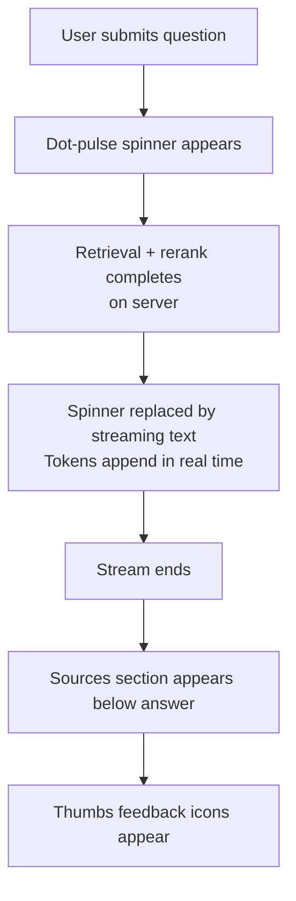

# Answer Streaming

## Problem Frame

The current API waits for the full Gemini response before returning, producing a noticeable delay (1–3 seconds) before any text appears. Streaming makes the product feel significantly faster — users see words forming immediately rather than staring at a spinner.

## User Flow

## Requirements

**Streaming Behavior**
- R1. Once retrieval and reranking complete, answer tokens stream to the browser in real time. The full retrieval pipeline (embed → search → rerank → threshold) still runs to completion before streaming begins — only the generation step is streamed.
- R2. The dot-pulse typing indicator is replaced by the streaming answer text as soon as the first token arrives. A blinking text cursor (`|`) appears at the end of the in-progress text.
- R3. Text is appended plain — no markdown parsing during streaming. The final rendered answer uses the same plain `<pre-wrap>` style as today.
- R4. Sources appear below the answer only after the stream completes. While streaming, the sources section is not visible.
- R5. If the stream produces the "no info" sentinel phrase, the message is styled in the dimmed italic style (as today) once the stream ends.

**Protocol**
- R6. The API response is a Server-Sent Events (SSE) stream. Each event is one of:
  - `{"type":"token","text":"..."}` — a text chunk from Gemini
  - `{"type":"done","sources":[...]}` — signals end of stream, carries the sources array
  - `{"type":"error","message":"..."}` — signals a pipeline failure
- R7. The `/api/chat` endpoint switches to SSE when the request includes `Accept: text/event-stream`. Existing non-streaming callers (e.g. tests, `curl`) continue to work by omitting this header.

**Error Handling**
- R8. If the stream is interrupted mid-response, the partial answer is preserved in the UI and an error notice is appended: "Response interrupted. Please try again."
- R9. If retrieval fails before streaming begins, the API sends a single `{"type":"error"}` event and the frontend shows the existing error state.

## Success Criteria

- The first token appears within ~500ms of the user submitting a question (down from 1–3s with the full-response approach).
- Sources appear once the stream ends, not before.
- Refreshing mid-stream does not produce a broken UI state.
- Existing behavior (no info detection, source chips, thumbs feedback) is unchanged for completed responses.

## Scope Boundaries

- No markdown rendering during streaming.
- No streaming progress bar or token count indicator.
- The retrieval pipeline (embed, search, rerank) is not parallelized with generation — it runs to completion first.

## Key Decisions

- **SSE over WebSockets:** Simpler server implementation, one-directional, works with Next.js API routes, no persistent connection required.
- **Plain text streaming:** Avoids markdown flicker from partial tokens; consistent with existing answer rendering.
- **Sources after stream ends:** Sources depend on the full retrieval result which is available pre-stream, but surfacing them mid-stream would be visually jarring. Small UX cost for cleaner sequencing.

## Outstanding Questions

### Deferred to Planning
- [Affects R6][Technical] Confirm the Gemini Node SDK supports `generateContentStream` and that streamed chunks are text-only (no embedded structured data). Plan accordingly if a wrapper is needed.
- [Affects R7][Technical] Verify that Next.js 15 App Router API routes support streaming `Response` with SSE headers without buffering.

## Next Steps
→ `/ce:plan` for structured implementation planning
