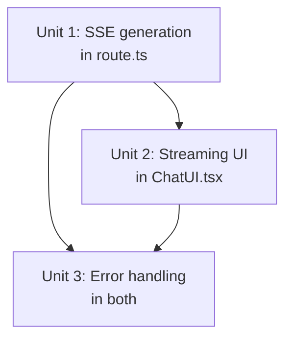

# feat: Stream Gemini Answers via SSE

## Overview

Replace the full-response wait with a Server-Sent Events stream. Retrieval and reranking still complete first (unchanged). Then the Gemini generation step streams tokens to the browser in real time. The frontend replaces the dot-pulse spinner with streaming text + blinking cursor; sources and thumbs appear once the stream ends.

## Problem Frame

Users wait 1–3 seconds staring at a spinner before seeing any text. Streaming shows words forming immediately, making the product feel dramatically faster (see origin: `docs/brainstorms/2026-03-30-answer-streaming-requirements.md`).

## Requirements Trace

- R1. Full retrieval pipeline runs first; only generation is streamed
- R2. Dot-pulse replaced by streaming text; blinking `|` cursor at end
- R3. Plain text append during stream; same `pre-wrap` styling at end
- R4. Sources appear only after stream ends (on `done` event)
- R5. "No info" sentinel detected and styled after stream ends
- R6. SSE event format: `token`, `done` (with sources), `error`
- R7. Header-negotiated: `Accept: text/event-stream` triggers SSE; non-streaming callers unaffected
- R8. Mid-stream interruption: partial answer preserved + error notice appended
- R9. Pre-stream pipeline failure: single `error` event

## Scope Boundaries

- No markdown rendering during streaming
- No progress bar or token counter
- Retrieval pipeline not parallelized with generation

## Context & Research

### Relevant Code and Patterns

- `app/app/api/chat/route.ts:304` — `POST` handler; entry point for both streaming and non-streaming paths
- `app/app/api/chat/route.ts:266` — `generateAnswer()` uses `model.startChat({ history })` then `chat.sendMessage(query)` — streaming variant replaces `sendMessage` with `sendMessageStream`
- `app/components/ChatUI.tsx:348` — `sendMessage()` — fetch call and message state updates to be replaced with streaming reader
- `app/components/ChatUI.tsx:199` — `TypingIndicator` component — replaced by streaming text while in-flight
- `app/components/ChatUI.tsx:330` — `[messages, loading]` state — add `streamingContent: string` for in-progress text

### Gemini SDK Streaming API

`@google/generative-ai` `ChatSession` has `sendMessageStream(message)` which returns `{ stream: AsyncIterable<GenerateContentResponse> }`. Each chunk has a `.text()` method returning the partial token string. Usage:

```
const result = await chat.sendMessageStream(query);
for await (const chunk of result.stream) {
  const text = chunk.text(); // may be '' for empty chunks
}
```

This is the only API surface change needed in `generateAnswer`.

### Next.js 15 App Router SSE Pattern

Next.js 15 App Router API routes support `ReadableStream` natively — return `new Response(readableStream, { headers: { 'Content-Type': 'text/event-stream', 'Cache-Control': 'no-cache', 'Connection': 'keep-alive' } })`. No buffering occurs because Next.js does not buffer `ReadableStream` responses. This is the correct pattern; no special configuration is needed.

## Key Technical Decisions

- **Header negotiation (`Accept: text/event-stream`)**: The single `POST /api/chat` handler branches on the `Accept` header. Non-streaming clients (tests, curl, potential future integrations) continue to work unchanged by omitting this header.
- **`ReadableStream` with `TextEncoder`**: SSE events are encoded as `data: <JSON>\n\n` using `TextEncoder`. `TransformStream` is not needed since we write directly to the controller.
- **`streamingContent` state in `ChatUI`**: A separate `string` state holds the in-progress text during streaming. On stream end, a final `Message` is committed to the `messages` array and `streamingContent` is cleared. This avoids accumulating intermediate messages in the list.
- **Sources emitted on `done` event**: Sources are fully known after reranking (before generation starts). They are buffered and emitted in the final `done` event. The frontend waits for `done` before rendering the sources section.
- **Error recovery**: If the stream `ReadableStreamDefaultController` errors, the partial text accumulated so far is preserved in `streamingContent`. The frontend commits the partial text as a message and appends an error notice inline.

## High-Level Technical Design

> *This illustrates the intended approach and is directional guidance for review, not implementation specification.*

```
Server (route.ts POST handler)
  │
  ├─ If Accept != text/event-stream  →  existing non-streaming path (unchanged)
  │
  └─ If Accept == text/event-stream:
       1. Embed + search + rerank (unchanged)
       2. If no results → send error event; close stream
       3. Build chat history + system prompt (same as before)
       4. call chat.sendMessageStream(query)
       5. For each chunk:
            encode → "data: {"type":"token","text":"..."}\n\n"
            enqueue to controller
       6. Stream ends → send done event:
            "data: {"type":"done","sources":[...]}\n\n"
       7. Close controller

Client (ChatUI sendMessage)
  │
  ├─ fetch with Accept: text/event-stream
  ├─ response.body.getReader() → ReadableStreamDefaultReader
  ├─ decode UTF-8, split on "\n\n", parse JSON events
  │
  ├─ on token event:
  │    setStreamingContent(prev => prev + text)
  │
  ├─ on done event:
  │    commit message to messages[] with full text + sources
  │    setStreamingContent('')
  │    setLoading(false)
  │
  └─ on error event or reader error:
       commit partial text as message
       append error notice to message content
       setStreamingContent('')
       setLoading(false)
```

## Implementation Units



- [ ] **Unit 1: Add SSE streaming path to `route.ts`**

**Goal:** When the request has `Accept: text/event-stream`, run the full pipeline and stream generation tokens via SSE. Non-streaming path is unchanged.

**Requirements:** R1, R6, R7, R9

**Dependencies:** None (can be developed against the existing `curl` test)

**Files:**
- Modify: `app/app/api/chat/route.ts`

**Approach:**
- At the top of `POST`, check `req.headers.get('Accept') === 'text/event-stream'`
- For the streaming branch: run embed, hybridSearch, rerank, filterByThreshold (steps 1–5) exactly as today
- If `topRows.length === 0`: return a `ReadableStream` that emits a single `error` event and closes
- Refactor `generateAnswer` to accept a `stream: boolean` parameter. When `stream=true`, call `chat.sendMessageStream(query)`, iterate `result.stream`, and `yield` each `chunk.text()` string via an `AsyncGenerator`. The SSE handler in `POST` iterates this generator and encodes each token as a `data:` event.
- After the generator completes, enqueue the `done` event carrying the `sources` array (same dedup logic as today)
- Return `new Response(readableStream, { headers: { 'Content-Type': 'text/event-stream', 'Cache-Control': 'no-cache', 'Connection': 'keep-alive' } })`
- Non-streaming branch is unchanged — `generateAnswer` with `stream=false` calls `sendMessage` as today

**Patterns to follow:** Existing pipeline structure in `route.ts`; `TextEncoder` for byte encoding.

**Test scenarios:**
- Happy path: `curl -H "Accept: text/event-stream" -X POST /api/chat -d '{"message":"..."}' ` returns a stream of `data: {"type":"token",...}` events followed by `data: {"type":"done","sources":[...]}`
- Happy path: existing non-streaming `curl` (no Accept header) still returns `{"answer":"...","sources":[...]}` JSON
- Error path: no matching documents → single `data: {"type":"error","message":"..."}` event, then stream closes
- Integration: `done` event sources array matches what the non-streaming path returns for the same query
- Edge case: Gemini stream yields empty chunks (`chunk.text() === ''`) — these are skipped and not enqueued

**Verification:** `curl` streaming test shows token events, followed by done event with sources; non-streaming callers unchanged.

---

- [ ] **Unit 2: Update `ChatUI` to consume the SSE stream**

**Goal:** Replace the single-JSON fetch with a streaming reader. Show tokens as they arrive; render sources and thumbs on `done`.

**Requirements:** R2, R3, R4, R5

**Dependencies:** Unit 1

**Files:**
- Modify: `app/components/ChatUI.tsx`

**Approach:**
- Add `streamingContent: string` state (`useState('')`) and `streamingSources: Source[]` state
- Update `sendMessage` to `fetch` with `Accept: text/event-stream` header
- After fetch, open `response.body!.getReader()` in a loop:
  - Decode UTF-8 chunks, accumulate a `buffer` string
  - Split buffer on `\n\n` to extract complete SSE events
  - Parse `data:` lines as JSON
  - `token` event: `setStreamingContent(prev => prev + event.text)`
  - `done` event: commit final message, clear `streamingContent`; sources and `noInfo` derive from `event.sources`
  - `error` event: fall through to error handler
- While `streamingContent !== ''` (streaming in progress), render a special in-progress message row instead of `TypingIndicator`: shows `streamingContent + |` (blinking cursor via CSS animation on the `|` span)
- After stream ends (either `done` or error), the in-progress row is replaced by the committed `Message` in the array
- `loading` remains `true` until `done` or error; send button stays disabled

**Patterns to follow:**
- `TypingIndicator` for the in-progress message bubble structure
- `AssistantMessage` for the final committed message
- CSS animation for blinking cursor: `@keyframes blink { 0%,100%{opacity:1} 50%{opacity:0} }` in `globals.css`

**Test scenarios:**
- Happy path: first token appears visibly before the full response would have arrived (observable in browser)
- Happy path: dot-pulse is replaced by streaming text on first token
- Happy path: sources section is absent during streaming, appears after `done` event
- Happy path: blinking cursor visible at end of in-progress text
- Happy path: after stream ends, final message renders identically to non-streaming answers (same font, color, sources, thumbs)
- Happy path: `noInfo` answers stream, complete, and then render with dimmed italic style
- Edge case: very fast stream (all tokens arrive in one chunk) — UI still transitions through streaming state

**Verification:** Browser renders streaming text token-by-token; sources appear at end; behavior is identical to non-streaming on completion.

---

- [ ] **Unit 3: Handle stream interruption and errors**

**Goal:** Partial answers are preserved on interruption; pre-retrieval failures show the existing error state.

**Requirements:** R8, R9

**Dependencies:** Unit 1, Unit 2

**Files:**
- Modify: `app/app/api/chat/route.ts` (already handled in Unit 1 for pre-stream errors)
- Modify: `app/components/ChatUI.tsx`

**Approach:**
- In the `sendMessage` stream reader loop, wrap in `try/catch`
- On `catch` (network error, stream abort, parse failure): if `streamingContent !== ''` (partial text accumulated), commit a message with content `streamingContent + '\n\nResponse interrupted. Please try again.'`, set `noInfo=false` (preserve partial text styling)
- If `streamingContent === ''` (failure before first token): fall back to existing error message behavior (`Something went wrong: ...`)
- Set `setStreamingContent('')` and `setLoading(false)` in a `finally` block

**Test scenarios:**
- Error path: server closes stream after 2 tokens (simulate with mock) — partial text + interruption notice rendered as a message
- Error path: server sends `{"type":"error"}` event before any tokens — existing error state shown (no partial text)
- Error path: network drops after `done` event is partially received — behaves as interruption (partial text preserved)
- Edge case: `reader.cancel()` called on navigation away — no state update attempted after component unmounts

**Verification:** Mid-stream failure shows partial text + notice; pre-stream failure shows standard error message.

## System-Wide Impact

- **Interaction graph:** `POST /api/chat` gains a conditional SSE branch. Non-streaming callers are fully backward-compatible (header negotiation). No other endpoints or components are affected.
- **API surface parity:** The non-streaming JSON response contract is unchanged. The streaming SSE protocol is additive.
- **Error propagation:** Pre-stream errors return an error SSE event; post-stream interruptions preserve partial state in the UI. No errors propagate to the parent component.
- **State lifecycle risks:** `streamingContent` must be cleared in `finally` regardless of success or failure to prevent stale text persisting across requests. `setLoading(false)` is also in `finally`.
- **Integration coverage:** Non-streaming path must be tested alongside streaming to confirm header negotiation is the only branch point.

## Risks & Dependencies

| Risk | Mitigation |
|------|------------|
| Next.js 15 buffering SSE responses | `ReadableStream` responses are not buffered in Next.js 15 App Router; verified via curl test in Unit 1 |
| Gemini SDK `sendMessageStream` not available in installed version | Using `@google/generative-ai: latest` — `sendMessageStream` has been available since v0.1.3; verify with `node -e "require('@google/generative-ai')"` on install |
| React state update on unmounted component (navigation during stream) | Add `let mounted = true` guard; skip `setState` calls if `!mounted`; call `reader.cancel()` in cleanup |
| SSE event JSON parsing failure on malformed chunk | Wrap per-event parse in try/catch; skip malformed events and continue reading |

## Documentation / Operational Notes

- No schema changes. No Docker rebuild needed unless dependencies change (package.json unchanged).
- After implementation, run QA on the streaming flow: verify first-token latency feels instant, sources appear correctly after stream ends, and existing team pages work identically.

## Sources & References

- **Origin document:** [docs/brainstorms/2026-03-30-answer-streaming-requirements.md](../brainstorms/2026-03-30-answer-streaming-requirements.md)
- Related code: `app/app/api/chat/route.ts:266` (generateAnswer), `app/app/api/chat/route.ts:304` (POST handler), `app/components/ChatUI.tsx:348` (sendMessage), `app/components/ChatUI.tsx:199` (TypingIndicator)
- Gemini SDK: `ChatSession.sendMessageStream()` — `@google/generative-ai` package
- Next.js 15 streaming: `ReadableStream` response in App Router API routes
